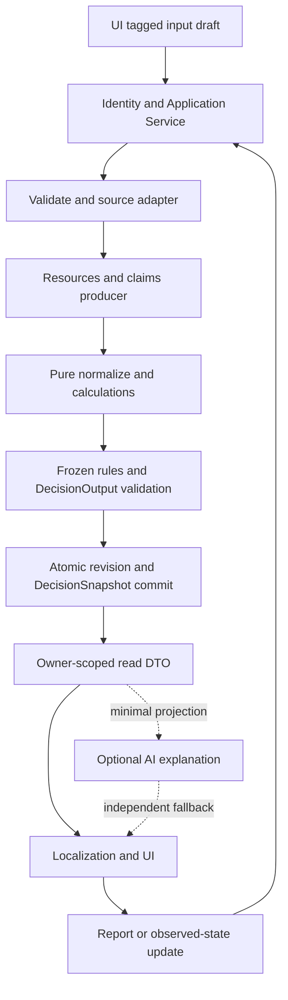

# BiBeck Money OS MVP — Technical Architecture V1

日期：2026-10-02。狀態：架構提案，可進入 implementation planning；不是 production 實作或金融政策核准。產品語言 zh-TW-first。

來源分支 `feature/bibeck-money-os-mvp-ux`，UX baseline `58372f705a270651ecd50dd6f773c830498887cd`；結構凍結 baseline `cfff3150fb5e6a258596fa54caa745023bcde894`。交付分支 `feature/bibeck-money-os-mvp-tech-arch`。

本次只新增本文件。不改 frozen contracts、UI、`/bybit`、auth、API、production schema、dependencies；不 migration、不 merge、不 deploy。

## 1. 架構結論與權威來源

採一個既有 Next.js 應用＋PostgreSQL、隔離的純 TypeScript domain module、同步分析、immutable input revision／DecisionSnapshot。App service 組合資料與交易；金融結論只能由版本化 frozen runtime 產生；locale 和 AI 不參與決策。先建立單一 repo 內 module，暫不引入 monorepo、microservices、queue、Redux 或 native framework。

權威：[已接受的 UX baseline](./BIBECK_MONEY_OS_MVP_UX_V1.md)、[Freeze closure](../money-model/BIBECK_MONEY_MODEL_V1_FREEZE_BLOCKER_CLOSURE.md)、[Execution contract](../money-model/EXECUTION_CONTRACT.md)、[Metric contracts](../money-model/METRIC_CONTRACTS.md)，及 `docs/money-model/schemas/`、`registries/`、`reference/`。舊 STRUCTURE_ONLY corpus、UI 文案及 legacy modelConfidence 都不能覆蓋 closure 行為。

APPROVE FREEZE 只核准結構，不將 WORKING／LOW／RESEARCH_REQUIRED 升為金融政策。V1 能誠實呈現 unknown、Discover、no-action、observation；不能保證所有 UX 願望都已有 producer。

本文件新增 envelope／command／storage version 是 application proposal，非 frozen schema 增欄。若 implementation 發現真正相容性衝突，停止該 slice、記錄與回報；不改原契約或新增 UI 金融規則。

## 2. Runtime layers 與依賴方向

| Layer | 責任 | 允許依賴 | 禁止責任 |
| --- | --- | --- | --- |
| Input / UI | 六個 UX screens、輸入草稿、render、navigation、無障礙 | app DTO、presenter、localization；type-only contracts | 算資金、判 high-cost、排序 rules、寫 DB |
| Application Service | identity scope、intent validation、版本選擇、adapter、transaction、recalculation | domain facade、ports、DTO codecs | 第二套公式、LLM 決策、直接讀 Next cookies |
| Domain | financial contracts、identity/invariants、closed ValueRef、producer eligibility | 同 domain module | React、Next.js、DOM、browser、DB、auth provider、locale |
| Calculation | 純 normalize＋八核心指標＋lineage，顯式 basis | domain validators、decimal arithmetic、immutable runtime bundle | I/O、Date.now、env、guessing policies、圖表公式 |
| Rule / Decision | tri-state predicates、排序、overrides、merge、primary、missions、confidence、provenance | domain context、frozen registries、output validator | UI stores、eval、投資建議、改 UNKNOWN |
| Persistence | owner-scoped repository、revision CAS、原子保存、receipts、history | app ports、Drizzle/postgres、storage codec | SQL 另算決策、改歷史 output、以 email 當 owner |
| Localization | semantic code→copy key→zh-TW params／格式；future en-US/ja-JP | validated DTO、catalog、display formatter | 改 severity/stage、編 mission、移除限制、換匯 |
| AI Explanation | 可選摘要／教學／閱讀層次，失敗 fallback | 最小 explanation projection、provider port | raw profile、financial authority、任務／provenance 寫入 |

Ports 在 application 定義，由 server adapters 實作；domain 不 import application。client bundle 不含 repositories、auth、policy registries 或全份敏感 inputRecords。以 import-boundary tests＋獨立 domain typecheck 驗收，不靠檔名保證。



## 3. Domain module 與最小 extraction

目標 `lib/money-model/`（內部 reusable package boundary；將來才包為獨立 package）：`contracts/`、`registries/`、`runtime/`、`arithmetic/`、`index.ts`。Facade 概念為 `analyze(inputSnapshot, runtimeBundle): AnalysisResult`；input 包含 frozen FinancialProfile＋NormalizationOptions，output 是 validated DecisionOutput＋受控 diagnostics。Clock／IDs／asOf／monthlyPeriod 由 caller 注入，不由 domain 取裝置時間。

production 不得直接 import docs reference。下一階段最小 refactor：抽出凍結 contracts／registries／有效 runtime 成為單一 executable implementation，原 reference entrypoints re-export 同實作；保留 frozen baseline archive/hash 與獨立 expected fixtures。金融 semantics 不改；extraction 是另行授權 slice，不在本次執行。

不可把整個 reference 當已安全 production：`reference/calculations.ts` generic sum/subtract 使用 native number 且缺 normalization lineage；`context-builder.ts` 是 fixture constructor。production 計算沿用 `profile-normalizer.ts` 的 decimalSum／identity／dependency 路徑，不用 generic helpers 或 createContext overrides 跳過 inputs。

目前 normalizer 同時做 calculations、flags、lineage；先保留同一純函式行為，邏輯層不等於十個服務。抽檔只有 parity tests 證明才進行。output validator 會用 registries 重新核對 ordered result，必須與 evaluator 使用同一 bundle，不能 current validator 驗 historical rules。

## 4. Application flow 與 Reality Loop

### 4.1 Create / update profile → analysis

1. Transport 驗 session→穩定 userId，建立 RequestContext；body 不接受 ownerId／可信 source／derived flags。
2. Validate command schema、payload limits、tag/money/date codecs、expectedProfileRevision、idempotencyKey。
3. Owner-scoped load current aggregate／mission ref；建立候選 source revision，絕不先覆蓋 current pointer。初次基準 revision 0。
4. Server adapter 產 frozen FinancialProfile、basis attestations、stable economic IDs；UNKNOWN 合法，structural omissions 要補資訊。本人輸入不能 client 宣稱 VERIFIED／CALCULATED。
5. Source＋assignment intents 生成 versioned resources／claims；驗 identity／lifecycle／funding，再注入 NormalizationOptions。沒有 policy 的欄位仍 unknown，不自動分配。
6. normalizeProfile 同時 normalize、核對 basis、計算指標／flags、建立 inputRecords／lineage。不要先用另一套 metrics 再覆寫。此函式需要 resources/claims，故生成在前；若 policy claims 依 metrics，須另行核准 acyclic producer，不反覆算到想要的結果。
7. Frozen evaluator：tri-state predicates→matches/candidates→overrides/merge→stage/severity/missions/confidence，產完整 semantic output。
8. 嚴格 validate context、DecisionOutput、snapshotId、versions、raw lineage；失敗不發布。合法 R-008 halt／R-015 scoped contradiction 是 domain 結果，不全當 system crash。
9. 同一短 transaction：CAS current revision→immutable source revision、producer snapshot、DecisionSnapshot、current pointers、command receipt／audit。Race／DB failure 全 rollback。
10. commit 後才回 owner-scoped DTO、localize、refresh UI。AI 在 transaction 外，不能延長金融交易或改 output。

可在 transaction 外用預留 UUID／clock 計算，最後 CAS 核對 source revision。不能 retry 重取不同 basis。不能只存 profile、保留舊 current decision 卻稱一致；未分析資料只為 draft。

### 4.2 Mission completion → state update

- reportMissionProgress 只存 IN_PROGRESS／USER_REPORTED_DONE 的 application record，綁 source snapshot＋missionId。不動 profile、fulfill claim 或套假 delta。
- confirmFinancialState 預設 OBSERVED_STATE：新 asset／debt／income 觀測值＋basis，走上述 pipeline。未知本金可回報目前餘額；未知餘額可 report-only。
- DECLARED_EVENT 是受限後續 slice：closed effects＋cashAsset／assignment／liability／principal／interest／fees／occurrence 全支持，fulfillment validation 原子套一次；不與同事件 observed balances 再疊加。
- modes 互斥；新觀測值不是 delta。receipt 是守恆／去重，不是外部完成證明。
- engine 新 mission 仍 TODO。Progress 獨立呈現，不合併寫回 authoritative DecisionOutput。相同 semantic missionId 跨 snapshot 不自動完成；history key 含 owner＋snapshotId＋missionId。
- VERIFIED_DONE 缺 completion-proof contract，MVP 禁止。「重算後條件解除」只是新的判斷，不倒填已驗證。

## 5. Source adapter、resources／claims completeness

這是 representation 邊界，不是新金融模型。Inventory 保留 NOT_CONFIRMED／PARTIAL／CONFIRMED；只有本人確認且 producer coverage 已驗證才映射 complete=true。共享 frozen completeness 不支援 cash-only 假完整 assets 或 30d-only 假完整 obligations。

| Producer | 支持的 source／行為 | 缺支持時 |
| --- | --- | --- |
| Assets → Resources | 同 assetId、settled owned cash、availability/restrictions；多 views 綁 disjoint assignment partitions | unknown ownership/value/date 留未知；future salary/credit 不變 cash |
| Assignments | 本人現有資金用途、金額對齊 source asset 與 claim／restriction | goal target 不是已保留；不創資產、不猜 unknown |
| Obligation/debt occurrences | 顯式日期／付款 identity／minimum／逾期；recurring template 與 dated occurrence 分離 | 不猜年化／自動展開；unknown breakdown 不 fulfill |
| Claims | 已知義務／chosen goal 映射 frozen type/origin/lifecycle/funding/effects；stable origin+occurrence | 必填 urgency/priority 等無版本映射就不造值，complete.claims=false |
| Research policy | SAFETY_BUFFER／HIGH_COST／sustainable goal 只接核准 producer/provenance | 無 producer 留 unknown，使用者不能勾 HIGH_COST 冒充模型 |

Representation catalog 每項列 source facts、schema、mapping、unknown 策略、policy approval。不可新增 decision priority；任何金融判斷回 frozen model／research gate。不能回空 claims＋true 做漂亮 R-014。

Claim completeness 需 inventories 確認、active obligations/debts/chosen claims 對帳和 producer coverage；validateClaims([])通過不是完整證明。lifecycle／cancel intents／occurrence receipts 保留 origin mapping，不能每次重生成重啟 FULFILLED。fundingStatus derive，不接受 UI 硬填。producer 缺能力是產品限制，不反覆責怪本人。

## 6. Persistence 設計（只設計，不改 DB）

SOURCE aggregate JSONB immutable revisions 起步，不為 income/expense/asset/debt 各建 CRUD 表；同 revision 的 collections 有 stable record IDs。Money 在 JSONB 為 tagged decimal strings；需要獨立 SQL 金額查詢才用 NUMERIC string mode，不雙存兩份 truth。

| Conceptual collection | 類別／最小內容 | 理由／約束 |
| --- | --- | --- |
| money_os_profiles | SOURCE index：profileId/ownerUserId/currentRevision/currentDecisionId | 一 user 一 aggregate、owner unique、CAS |
| money_os_profile_revisions | SOURCE/HISTORY：revision/schemaVersion/payload/basis/completeness/observation/createdAt/commandId | income sources、expenses、assets、liabilities、obligations、goals、household、assignment intents；immutable |
| money_os_decision_snapshots | DERIVED/AUDIT：inputRevision/producer manifest/versions/full validated output/diagnostics/fingerprint/createdAt | 真正已發布結果與 provenance，不覆寫；manifest 一次供 replay |
| money_os_mission_reports | SOURCE/AUDIT：owner/sourceSnapshot/missionId/progressRevision/status/reportedAt/linkedUpdateRef | 本人紀錄，不改 engine TODO，無 VERIFIED_DONE 捷徑 |
| money_os_command_receipts | AUDIT：owner/operation/key/canonical payload digest/resultRefs/createdAt | 安全 retry，不二次 effects；digest 不入普通 logs |
| money_os_effect_receipts | AUDIT（event slice）：owner/occurrence/effects fingerprint/before-after revisions/commandId | unique recurring template+occurrence，rename 不繞去重 |
| money_os_audit_events | AUDIT：actor scoped ID/operation/record-revision refs/time/outcome | 不存 balance / payload；追蹤權限及刪除操作 |

Assignments 的用途／金額是 SOURCE intent；available 額、resource views、claim funding、metrics 為 DERIVED。claim cancellation／occurrence completion 是 SOURCE workflow intents/receipts，不由 mission 報告推導。

不另存可獨立更新的 current stage/metrics/flags，不建永久 normalized-context cache。output 已有 consumed inputRecords 是必要 audit 重複，不再把整 profile 複製到每 mission；input revision 供 replay、output 供當時展示。MVP 無 CACHED DATA 持久表。

Transaction＋revision conditional update＋owner-scoped foreign keys/uniques；所有 snapshot/mission/receipt refs 同 owner。receipt 和 source change 同交易；沒有先扣後記。Retain history 不表示無限保存，見§21。

## 7. Data versioning／historical replay

| Version | 提案／現況 | 規則 |
| --- | --- | --- |
| profileEnvelopeVersion | app 1.0.0（提案） | codec/metadata 升版，不給 frozen profile 加欄 |
| MoneyModelBundle | money-model-v1@cfff315＋完整 artifact digest | 保存 runtime/registries，不代替逐 model refs |
| Rule/model versions | closure active 多為 1.1.0，future slots 可 0.0.0 | 每 used id/version 保存，不假定全同版 |
| DecisionOutput | frozen version1.0；evaluation.schemaVersion1.0.0 | 不默改、不對 unknown version 降級 |
| Producer | app producerBundleVersion/digest（提案） | mapping/completeness/identity 改變升版 |
| Mission | frozen 無 missionVersion 欄 | snapshot mission_v1 modelRef+ruleRef 決定 definition；progressSchemaVersion 獨立 |
| Policy config | immutable bundle ref＋assumption revisions＋consumed values | 值/限制/source 改變升版，不只改 env |
| Localization | catalogVersion/locale/presenterVersion | wording 升版不重算 finance；需要時記 render receipt |
| DTO/precision codec | app 獨立版本 | serializer/limits 改變須 contract tests |

歷史 output 按原 bundle validator，不用 current registry 否定舊結論。Replay 同 input revision、producer manifest、config、asOf/period/runtime/codec，不讀現在 balance 或月份。比較 canonical semantic result；execution IDs/timing 不是 financial 差異。

缺 historical artifact→UNSUPPORTED_MODEL_VERSION；保留受控歷史讀取，不用最新 rules 改過去。Replay 不認證原始資料真偽。migration 不偷改歷史 decision。

## 8. DecisionSnapshot

每次成功且已發布 analysis 存 immutable DecisionSnapshot；不是 keystroke、GET、AI response。失敗不建假有效 snapshot，保留 draft/last valid。相同 command retry 或 analysis fingerprint 重用；重新確認 asOf 是新 observation/revision，即使數字相同也合理，不稱進步。

最小內容：owner/profile refs、snapshot/evaluation IDs、inputRevision/sourceDigest、profileSchema、producer/runtime/rule/model/config refs、assumption/evidence revisions、asOf/monthlyPeriod/calendar basis、full validated DecisionOutput、必要 semantic diagnostics、producer manifest、createdAt。output 已有 ruleRefs/assumptions 不另存可漂移副本；catalog ref 在 render receipt，不塞 domain。

Fingerprint 含 source revision、basis/completeness、resource/claim/assignment manifest、policy values/revisions、runtime/output/codec versions、financial asOf/period。locale/AI/latency 不影響 finance。current pointer 只指向同 current input revision 的成功 snapshot；pending/failure 不能偷偷換 metrics。

## 9. Minimal API／service contracts

先 framework-independent services。Server Component 直接 read service，不 HTTP fetch 自己；web mutation 薄 Server Action，future native 才加同 intent Route Handler transport，不先建 CRUD。Server Action 每次 authorization/validation，隱藏按鈕不算保護（[Next.js data security](https://nextjs.org/docs/app/guides/data-security)）。

RequestContext：server-authenticated subject、requestId、injected clock。response 為 OK{profileRevision,decisionSnapshotId?,dto}或 typed AppError。body 不得接受 context/output/config/ownerUserId/trusted source。

| Intent | Input | Output | Validation／errors | Idempotency |
| --- | --- | --- | --- | --- |
| getWorkspace | session owner，無 body | source DTO / basis / current result / missions + separate reports / freshness | UNAUTHENTICATED/UNAVAILABLE/UNSUPPORTED_SCHEMA_VERSION；無 profile→NEW_USER | read-only 不重算 |
| saveProfileAndAnalyze | source edits/basis/expectedRevision（初次 0）/key | committed revision+snapshot/read DTO，partial 合法 | field/currency/basis/CAS/domain-output fault | 同 key/payload 回原 result；異 payload 衝突 |
| reviewCurrentState | revision/confirmed asOf-period/unchanged 或 REQUEST_REVIEW/key | reuse 或新 observation/snapshot+cause | basis/future stock/version/CAS | 同 fingerprint reuse；日期變可改 horizon |
| getDecisionDetails | snapshotId/conclusionId? | owner-scoped Why/history refs | NOT_FOUND（含非本人）/unknown conclusion/version | read-only，歷史明標 |
| reportMissionProgress | sourceSnapshot / missionId / status IN_PROGRESS 或 USER_REPORTED_DONE/reportRevision/key | separate report+decision ref | membership/relevance/STALE_MISSION/status/CAS | 不改 finance，同 key 不重報 |
| confirmFinancialState | OBSERVED_STATE/source edits/dates/revision/mission ref?/key | 共用分析 result/change refs | format/invariant/mission link/CAS/output failure | 與 save 同 implementation，無第二 recalc API |
| applyDeclaredEvent（後續受限） | closed effects/occurrence/breakdown/funding refs/revision/key | receipt+newrevision/snapshot 或 no-op | known amount/compatibility/conservation / occurrence conflict | command key+economic identity+effects equality，atomic |

getMissions 是同 output read projection，不存第二待辦 truth；runAnalysis/recalculate 是 private service path，不開任意 rule endpoint。future deleteFinancialData 是 privacy intent，owner re-auth/policy/audit 另審，不用 generic cascade 刪其他 workflow。

Key scope=(owner,operation,key)，receipt 保存 canonical validated semantic payload digest/basis/result refs，不依 form 欄位順序。Retry 先核 receipt 再看 revision；response lost 可回原成功。異 key 同 occurrence 也不二次 effect；terminal 不可 reopen。CAS 衝突不 silent merge balances，回最新 revision 供確認。

## 10. UNKNOWN serialization

Frozen DomainValue 的 KNOWN／UNKNOWN／NOT_APPLICABLE 三態保留；legacy DataPoint 只由 adapter 生成，app DTO 全部 tagged。Money DTO 例（非 frozen 型別）：

```json
{"status":"KNOWN","data":{"value":"30000","source":"USER_REPORTED","updatedAt":"2026-10-02"}}
```

UNKNOWN／NOT_APPLICABLE 只有 status＋reasonCode，不准 hidden value／data／null placeholder。零是 KNOWN「0」；unknown boolean 不變 false；NOT_APPLICABLE 需模型支持，沒有債務是確認完整的空 inventory。

```json
{"status":"UNKNOWN","reasonCode":"NOT_REPORTED"}
{"status":"NOT_APPLICABLE","reasonCode":"SUPPORTED_INAPPLICABILITY"}
```

上述 reasonCode 是 serialization 示意，不授權新增金融適用性規則。Runtime 仍驗證 frozen 合約所支持的 reason／producer；form 不知道只映射 UNKNOWN，不自動映射 NOT_APPLICABLE。

UNANSWERED 只 draft；server 於適用 frozen 欄轉 UNKNOWN(NOT_PROVIDED)，另留 answer metadata。PATCH omission=keep，explicit UNKNOWN=set UNKNOWN，刪 record 用 explicit intent；null 不是 unknown/delete shorthand。

DTO/DB/domain/output/localization round-trip 保 reason/source/date；completeness 與 tag 是兩維。UI 禁 value??0、parseFloat(unknown)、missing length 判健康。

## 11. Money／currency representation

Source money 用 canonical base-10 decimal string＋currency/unit metadata，JSONB/HTTP 同 codec。SQL 獨立欄若需要採 exact NUMERIC、driver string mode，不用 FLOAT/DOUBLE。NUMERIC 設定 scale 可能 round，不能暗設所有貨幣兩小數（[PostgreSQL numeric types](https://www.postgresql.org/docs/current/datatype-numeric.html)）。

Source codec 接受有界字元數的非負 finite decimal；拒 exponent/NaN/Infinity/locale separators/malformed。UI locale parser 負責移顯示 separator，不猜；technical digit/payload limits 下一 planning 設定，不是金融門檻。

sum/subtract/share multiplication 用 canonical coefficients / exponent＋internal BigInt，重用 frozen decimal 路徑，不另寫公式。BigInt 不進 JSON/RSC。保持 frozen FinancialInput<number>/DecisionOutput<number>：轉 Number 前後 exact canonical decimal round-trip 相同才接受（不是要求所有十進位 IEEE binary exact）。0.1、0.2 可接受，decimalSum=0.3；9007199254740993 必須拒 loss conversion。不能靜默 round。

Result 超範圍按 frozen guard UNKNOWN／拒 invalid effect。DB 支援 NUMERIC 不表示 domain 支援任意精度；超出 envelope 需 contract 升版，不本次開 freeze。precision mismatch 是 validation error，不把錯數送 domain。

金融 source/effects 不 round、epsilon、minor unit guess。Runway/DSR 按 frozen division 有限 number 近似值，是 months / ratio 非 money；不可用 display-rounded 數做 rule comparison。principal + interest + fees exact reconcile。

Display 在末端用 Intl/currency/unit，month/ratio 加約數；DSR 0.25→25%。非零小額不得無提示顯零；支援看完整 digits。負 liquidity 呈缺口，但 signed 值不 clamp。display precision 版本化，不回寫 source，不影響 rules。

每 money 欄 meta 保 currency，adapter 僅同 normalized primary currency 進 frozen global profile。混幣保留 source 並阻相關 analysis scope、不 FX、不改標 TWD。public currency selector 不改 financial profile/balances；locale 不決定 currency。future currency catalog 是 representation 支援，不承諾 global policy。

APR 是 rate，app DTOunit APR_PERCENT、12 代表 12%；V1 adapter 保留 12 原數，不做分類門檻或與 DSR 0.12 混用。frozen APR 只判 known eligibility；此 codec 口徑實作前 contract test 固定，不假 nominal/promotional=APR。

## 12. Time／basis

| 概念 | Representation |
| --- | --- |
| Date-only/due date | ISO YYYY-MM-DD＋real calendar validation，browser local midnight 不轉日 |
| Monthly period | YYYY-MM＋explicit net monthly basis；未核准 periodization→unknown |
| Stock | observedAsOfDate／支援時 observedAt instant；與 savedAt 分開，同 asOf；future stock 不當當下 |
| Audit/event | UTC ISO＋DB TIMESTAMPTZ；displayZone 為 IANA |
| Financial calendar | profile envelope explicit financialCalendarZone；Taiwan-first 可預填 Asia/Taipei 並確認，不 hard-code 全球 |

Frozen normalizer 用 date-only asOf、dueDate 差/86400000、30/90/365day horizons。adapter 交入同已確認 calendar 日期，不改成月底／device hour。calendar/basis 未知要求確認相關 structural basis。future due date 合法；future valuation / classification / stock 不能 certify known。

evaluatedAt 由 server 注入；createdAt 保存時間，observed date 是金融日期。refresh 不改原 observation。新 asOf/period 需本人確認；unknown 不假「今天未變」。無硬編 7/30 日 stalepolicy、自動 recurring 展開；overdue 未付仍保留。

## 13. Pure calculation engine

同一 immutable typed snapshot＋同 bundle／config／asOf／period 得到同 semantic 結果。IO、clock、IDs 在 application 注入；無 random、env 讀 policy、side effects。計算錯誤與 unknown 分開。

| Metric | Frozen definition／依賴 | Guard |
| --- | --- | --- |
| Net Monthly Income | 完整 approved net monthly income sources 加總 | 借款／賣資產本金不是 income；未核准 irregular basis unknown |
| Core Monthly Outflow | 唯一 economicPaymentId union：necessary/other required、debtminimum、required recurring | components 取代 aggregates；overlap 分類/金額/identity 矛盾 unknown |
| Core Cash Flow | NMI−CMO | signed；正值非健康認證 |
| Monthly Surplus | CCF−discretionary | CMO 已扣 minimum/obligation 不二扣；不是現 cash 或可投資額 |
| Net Worth | 同 asOf owned asset values−liability balances | purpose/resource 不加資產；joint/valuation 不支持 unknown |
| Safety Liquidity | owned realizable value−unique reservations−horizon 內 uncovered required occurrences | reserved claim 扣一次；future/external/credit 排除；30/90/365d 須相同完整 scope |
| Runway | post-obligation liquidity30d÷CMO | CMO 須>0、結果 finite；負值保留缺口、零非 infinity |
| Debt Service Ratio | dedup mandatory monthly debt payment÷NMI | NMI 須>0；0.25 是 ratio、非 money；不套 risk threshold |

每個 metric 保 ValueRef/unit/currency/timeBasis/sourceInputRefs/valueDependencies/confidence。N/A 不默當 0，只支持模型明示排除；required unknown 向下傳播。沒有八個都 KNOWN 的前提才能給獨立 repair。

Sustainable goalcapital／long term capital／goal conflict 仍 Research Required；公式寫在文件不代表 producer 存在。不算 tax/insurance/risk allocation；不以 NMI−CMO 給投資比例。

## 14. Decision engine

1. normalized state：只讀 closed ValueRef，unit / type / sign / basis 驗證；不任意 property traversal/eval。
2. metric/flag producers：同 frozen 來源，policy unknown 保留；不信 client flags。
3. matching：TRUE/FALSE/UNKNOWN，rules 只 known required inputs 給金融 action；discovery 是 explicit 規則，不猜 unknown=false。
4. candidates：保 rule/version/finding/inputdeps；phase→order→stable lexical ruleId，不 registry 偶然順序。
5. overrides：R-008 CRITICAL_HALT 全域守恆；R-015 BLOCK_DOWNSTREAM 只相關 cash-flow dependencies；已知獨立逾期仍 repair。
6. merge/primary：financial supported action 不被 Discover 抹掉；一 main、0–3side。R-014 不得清已有 action。
7. stage/severity：stage 來 primary problem，不是 rank；severity 獨立 highest finding。no-main 不證 Optionality。
8. missions：rule candidate 到 semantic Mission，保 why/action/impact/verification/confidence，不由 UI 推薦。
9. provenance/output：保所有 main/side/findings/metrics 的 chain、raw lineage、assumption/evidence revisions、config values；validateDecisionOutput 後才 publish。

Facade 不讓 UI 逐 rule 呼叫、不暴露 context overrides。Reference output 包含 flags/blockers/matchedRuleIds/halted 等 diagnostics；application 可分類 R-008 等 UX repair state，但不能拿 halted alone 當系統故障（Discover 也可能 halted）。保 complete DecisionOutput 權威，legacy modelConfidence 不上 UI。

## 15. Configuration strategy

RuntimeBundle 提案在 lib/money-model/registries，immutable manifest 選定 contract/runtime / rules / models / evidence / assumptions / config values 與 digest。App 啟動只選 bundle ref；金融值不散 magic numbers、不因 dev/prod 不同。

現況 createContext 以 v1AssumptionConfig 注入 minimumViableLiquidityMonths=1，normalizer 未提供 public config parameter。不能 pretend 現 reference 可任意注入；Slice1 需把同 registeredconfig 值納入 explicit bundle injection 並同步 validator/provenance，baseline1 行為 parity，原 frozen 文件與 contract 不改。若要改 threshold／UNKNOWN 設定的既有 financial semantics，先獨立版本審閱，不在 app 覆寫 flag。

AS-001 仍 LOW/RESEARCH_REQUIRED/revision1，evaluation.configValues 保存 consumed 值、provenance 保存 assumption ref 與限制。切 policy 值要 bundle/version/revision，不依 ENV；ENV 只 infra credentials/endpoint，非 APR/financial policy。

正式 policy 未批准不啟用高成本／goal producer；目前 reference fixture 的研究 milestone 不因提取 runtime 自動核准對外建議。V1boundedMVP 可先 Discover/unsupported state，不承諾全部 positive financial actions 可 launch。

## 16. Localization architecture

Domain code＋typed params→presentation key registry→catalog zh-TW→formatter→UI。例 REPAIR_CORE_CASH_FLOW 映射 moneyOs.mission.repairCoreCashFlow.title/why/action/impact/verify；metricValueRef 映射 label 與 unit formatter。catalog 無 if(rule threshold)或 formula，不能把 missing 改 no-action。

zh-TW 是 primary 完整 catalog；en-US/ja-JPfuture 只添同 keys/params，不改 domain。Fallback 固定 zh-TW（或產品明示 supported locale），未知 semantic code→「這項說明暫時無法顯示」＋safe diagnostic，不 AI 猜金融結論；financial state 本身仍可讀。

Keys 覆蓋 stage/severity/missiontype/status、finding/reasonCode、missingInformation、assumption/research 限制、units、六塊 Why。型別化 placeholder，不 HTML 注入、不拼裸 usertext。Copy version 與 runtime version 分開，snapshot 版本變化不是人變好。

ReadDTO 包含同 snapshot metrics/conclusions 與經 ownerfilter 的 Why projection。WHY 六塊保資料/unit / date / source、metrics/basis、rule mechanism、assumptions、missingdeps、limits/change conditions。不能 main-only 丟 side provenance。

Formatter 不依 publicPreferencesProvider 的 currency 換 profile；financialCalendar 與 display locale 分開。現在 messages/index.ts＋zh-TW.json 及 config/locales.ts 只用於 public web；future Money OS catalog 命名空間獨立，本次不修改它們。

## 17. UX state management

| State category | Authority／策略 | 不做 |
| --- | --- | --- |
| Server state | profile/current revision/DecisionSnapshot/reports；service read DTO | 多 clientstore 寫同 financial truth |
| Form state | React local state/reducer 管理六 screen 草稿／errors/UNANSWERED；confirmation 才 commit | autosave 成 current financial profile、localStorage 敏感預設 |
| Derived client state | expanded panels、navigation、formatting、同 snapshot UX variant selector | 算 CCF/分類 debt/重排 rules |
| Domain state | validated immutable typed input/output 在 server domain runtime | React context 當 domain engine |

最小 React local reducer＋Server Component read＋mutation 後 refresh；無 Redux/SWR/TanStack 新增必要。避免 optimistic financial results；等待 committed response 才換 pointer。Request 的 expected revision / response identity 檢查保護 out-of-order response，不舊 analysis 覆蓋新。

UX state projector 依 approved UX：supported mission、Discover、R-014no-action、observation、合法 correction state；missing 可與 action 同時。loading/error/report-only/stale 是 appvariant，非新 financial enum。三目的地目前狀況/下一步/我的資料；六 screens S01ENTRY/S02DATA/S03CURRENT/S04WHY/S05MISSION/S06UPDATE，不新增 IA。

MVP session-memory draft；若要 persistent/offline draft 需 privacy/resume 設計另審，不默 localStorage。Session expires 保未提交草稿於記憶、遮敏感 result、重新登入；跨 user 不可延用 previous draft。未 online 提交不稱已完成 recalc。

## 18. Auth boundary（只文件）

MoneyOS 需要 IdentityPort：stable opaque userId、session validity、authorization context、可選 recent-auth 能力。Domain 不識 email/Google/Auth.js；FinancialProfile 無 owner，ownership 是 application/persistence 邊界。

現 auth.ts 是 Google verified email＋admin allowlist、JWT8h；lib/admin-auth.ts 只 requireAdmin/getAdminEmail，沒有已確認 consumer stable userId。不能 reuseADMIN_EMAIL_ALLOWLIST 作 consumer access、email 當 primarykey、或放寬 adminlogin 來做 MoneyOS。未來 identity adapter／consumer flow 需獨立授權 slice，不本次改 auth。

每 read/write/snapshot/mission/receipt 用 server userId filter，nested IDs 也驗 owner；frontend route guard 不代替 record authorization。Identity missing fail-closed。未來 native 同 service，auth transport 可不同；不可 domain couple provider。現階段可 fake IdentityPort 測單人隔離，但不稱 production auth 已完成。

## 19. Security／privacy requirements

- TLS in transit；DB TLS、managed encryption at rest、備份 access control；不自行發明 crypto。
- Least privilege：app DB 角色只需 Money OS scope；未來 schema/role migration 另審，不增 admin 對 consumer profiles 默認權限。
- 每 server command runtime validation、schema/version allowlist、size/rate/resource limits、server-owned source/confidence/version。
- HTTP/Action mutation CSRF/origin/session protections 與 ownerchecks；idempotency 不替 authorization。
- 不 collectbank/exchange credentials、IDcard/salaryfiles；goal/account names 可省略。既有 public attachment storage 不能存 financial profile。
- personalized routes noindex、private/no-store，no public CDN/ISR/cache；不當 SEO JSON-LD、OGscreenshots 或 analytics payload。
- JSON/DTO 最小 projection；user text escape，AI 不得 markdown link/prompt 內容觸發 tools/actions。
- scoped audit、安全 errorcodes，無 stack / schema / private payload dump。
- DBbackup/restore、retention/deletion、production data access 與 incident 流程需 launch 前 review；spec 不宣稱合規認證。

## 20. Logging／observability

Allowlist：randomrequestId、operation、error category / validation code、runtime/model/rule bundle versions、ruleIDs、耗時、contract validation pass/fail、retry/CASoutcome。User identifier 若需連結用 restricted pseudonymous correlation，非 email；ruleIDs 仍可能揭示金融狀況，不能當 public analytics，限 debugrole。

禁止 balances、income/liability/goalamounts、full profile／inputRecords／output params、session token / cookie/DB URL、plaintext names / email、effect payload/digests 作 public telemetry。safe error 不把 exception.message 原樣輸出。

Wrong-decision debug：request correlation→restricted audit snapshot ref→另受控 owner/support consent 的 provenance inspection＋historical replay，不把 raw data 送 log。一般 metrics 只 aggregated latency/errorcounts；不能金融 amount 作 metriclabel。

Snapshots 本身敏感，不「去識別」就任意給 LLM/analytics。Provider error logs 須 redact；AI 失敗 category 只統計，不記 input text。

## 21. Retention／audit／privacy control

Immutable 是禁止靜默改歷史，不是永不刪除。刪除 financial profile 需涵蓋 source revisions、DecisionSnapshots/inputRecords、producer manifest、mission reports、receipts、explanation cache/exports 及 backup expiry；既有 rebatecase 另 policy，不能連帶 generic cascade。

MVP 沒有 analytics financial payload 或 AIcache，減少刪除面。Retention duration 與 backup expiry 是 launch 前實際 privacy decision，不在技術 spec 猜 7 年/30 天。必要 audit 保最小 operation metadata，亦須法規/產品審閱；不藏完整 payload 於 audit 逃過刪除。request receipt / key 保留期間須可證重試/occurrence 不重貼效果；刪除 account 後禁止舊 identity receipt 再跑。

Data export 僅本人授權、最小 profile/history；support access 明確授權/audit、no shared admin visibility。不部署或 build 刪除 tooling 本次。

## 22. Error model

AppError 提案：category、safeCode、fieldRefs（不值）、retryable、requestId、lastValidSnapshotRef?。Transportstatus 與 UIcopy 各映射，frozen semantic finding 不包成 exception。

| Category | 使用／回應 |
| --- | --- |
| VALIDATION_ERROR | 格式/date/tag/precision/enum/size；保 draft、field 提示，不新 snapshot |
| MISSING_REQUIRED_INFORMATION | structural basis 缺未能 analysis；可 analyze 的 financial unknown 走 validoutput+Discover，不 400 |
| CONTRADICTORY_STATE | 合法 R-015 或 R-008correctionprojection；有 validoutput 就 commit 並顯限制，不抹 independent repair |
| DOMAIN_INVARIANT_VIOLATION | unsafe effect/orphan/invalid output/version-provenance violation；rollback，safe error，調查 bug |
| UNSUPPORTED_MODEL_VERSION | 沒 historical runtime/unknown bundle；不改用 latest finance |
| UNSUPPORTED_SCHEMA_VERSION | DTO/source version 不懂；不 silent coerce |
| UNSUPPORTED_CAPABILITY | event/proof/policy producer 不存在；如實限制，不 fake fulfilled |
| REVISION_CONFLICT / STALE_MISSION | 更新來源已變；reload/本人核對，不 auto merge balance |
| IDEMPOTENCY_CONFLICT | 同 key 不同 payload 或 occurrence effect 不一致；不 apply |
| UNAUTHENTICATED / NOT_FOUND | session 缺／非本人 refs（不洩存在） |
| UNAVAILABLE / INTERNAL_ERROR | DB/transport/systemfault；retry 可安全，保 last valid/draft |

Inputs 未知不是 systemfault；expected correctable states 和 actualbugs 分開。Rulehalt 不等 throw；output invalid 不能 locale 遮掩。舊 snapshot 顯「上次」，不能新 profile 配舊 metrics 冒充更新。

## 23. Recomputation strategy

MVP 同步，無 queue/jobs/cron。Saveprofile/actual income/debt/goal/assignment/obligation state change、confirmedobservationasOf/period、manual review 需要時重算全部 cheap context。同一 service 不每 field/每 rule endpoint。Reportonly、locale / expand / navigation、read、AI response 不重算。

Synchronous=同 command 完成 validresult 才 commit；timeout/failure 不 commit 半結果。重試 idempotent，不 request abort 就假已取消金融 effect；lost response 查 receipt。AtMVPprofile 有界大小與計算 timeout；pending 變化可留 clientdraft。If 測量真的超 budget 才另外評估 async jobs，不先引入。

Model/config 升版時不是 silentGETrecompute。標 available basis update，明示新版本 review command、新 snapshot/cause；financial progress 比較須 same versions / basis 或清楚標差異。支持 schema migration 另 gate，不暗 recompute 所有歷史。

## 24. Cache strategy

Cheap deterministic calculation 優先重算；不 Redis、cross-user global cache、CDN personal data。Snapshot 是 history/consistency，不是盲目 cache。Analysis fingerprint 去重同版本同 basis，不跨 owner。

Workspace/detailread 用 private, no-store；ServerActions 之後刷新 owned route projection。避免 public root Preferences / SEO / sitemap 與 personal state 共享 cache。沒有 GET 動作暗製新任務。後續要 cache 必須 owner / revision / bundle / asOf / period key＋明示 invalidation、安全 review，不 MVP 自加。

## 25. AI explanation interface

DecisionOutput 始終 authoritative。ExplanationPort input 概念：snapshotId、locale/reading level、selected conclusion's semantic codes/params、必要 metric/units/basis、confidence/reasons、assumptions/limits/missing、approved localized definitions。不是 rawprofile、完整資產/負債列表或 authentication metadata。

Default 模板全功能。若 future provider 另獲 privacy authorization，projection 也須明示包含的敏感財務數字、最小化／必要同意；structured 不等匿名。Output 僅 plaintext＋usedConclusionRefs＋explanationVersion，無 commands/deltas/mission status、tool capability、任意 financial links；不寫回 domain/source/snapshot。

AI 可 summarize/explain/teach/adapt reading；不可改 stage/severity/confidence/assumptions/ruleoutcome、新 mission/amount/unsupported causal recommendation。針對 schema/refs/numbers/forbidden codes 驗輸出，但不能聲稱 automated checker 能證所有語意一致；不能確保的自由 financial paraphrase 直接不用，critical financial instructions 保 deterministic copy。

## 26. AI fallback

AI 未設定／timeout／provider error／unsafe / inconsistent copy→版本化 semantic template；核心 analysis/mission/Why 仍可用，無 loading 阻住 result。AI request 在 financial commit 外，有 budget/cancellation、不重試到無限。錯 locale/missingkey 不請 AI 補金融文案。

No-AI adapter 是 MVP 預設，不新增 SDK/provider package/外送資料。Futureexplanation 可獨立 serviceport，不微服務；不可 AIavailability 改 financial snapshot fingerprint 或回 no-decision。

## 27. Frontend boundary（不建 UI／不定視覺）

| Component 概念 | 消費資料 | 不能做的事 |
| --- | --- | --- |
| FinancialInputForm | editable source DTO、欄位 metadata、basis、validation codes | 生成 trusted flags、金融結論、VERIFIED source |
| SnapshotView | 同 snapshot 的 DecisionOutput metrics／stage／confidence projection | 用 raw profile 再算一套 dashboard、用 partial cash 冒充完整淨值 |
| BottleneckCard | output primaryBottleneck、支持 finding／snapshot refs | 獨立選 primary、main null 即判健康 |
| MissionCard | output Mission＋分離的 application progress report | 改 engine mission definition／status、直接扣款 |
| ExplainabilityPanel | owner-scoped Why projection：conclusion／rule／assumption／source lineage | main-only 裁掉 side support、露全 profile、猜 unsupported consequence |
| MissingInformationPanel | output missingInformation／dependency refs＋field mapping | 全局阻擋獨立 repair、producer 缺失當使用者沒填 |
| FinancialStateUpdateForm | source values、觀測日期、intent mode、revision、linked mission | 自動 principal delta、把目的轉換當淨值增加 |

Server Components 做 owned read／presentation；Client Components 只表單、展開、確認、navigation。JSON DTO 跨 boundary，不送 BigInt、DB client、class、完整 domain registry。定位在新 Money OS surface，不把 public /tools/life-allocation scaffold 暗換成收集資料的產品。

No-action／observation／Discover 是根據同 validated output 的 deterministic presentation mapping，不是另一 financial evaluator。Invalid output 不能直接顯示；missing copy 不代表改金融結論。

## 28. Mobile／future app portability

同一 server domain runtime 支援 responsive web、後端 service/API，iOS／Android 透過 future transport 呼叫同 intent。Contracts、unknown tags、decimal codecs、semantic keys、snapshot／revision／command identity、UX transitions 都不綁 React/router/DOM/auth provider。

原生 client 不直接執行 Node code；可用 language-neutral JSON contracts 重用服務權威。不現在選 React Native／Flutter，也不承諾離線 local financial decisions。若未來 port evaluator 到其他語言，須完整 golden／adversarial parity、版本化 arithmetic／provenance，不在 client 複製簡化模型。

390px-first 六個 screens／三目的地共用 service semantics。操作 focus、返回草稿、錯誤關聯、labels/units、文字放大驗收留 UI slice；desktop 不新增第二套流程。本次沒有 rendered UI／browser／native validation。

## 29. Test architecture

| Layer | 驗收 | Oracle／範圍 |
| --- | --- | --- |
| Unit | tags、decimal codec、calendar／basis、identity、canonical fingerprint、localization params | 手寫邊界，不用 evaluator 生 expected |
| Calculation | 八 metrics、signed values、zero denominator、重複付款／reservations、0.1+0.2、超精度 | frozen metric contracts／獨立數字；非 display screenshot 當算術 oracle |
| Domain rules | phase / order / ties、requiredKnownInputs、R-008/R-015、repair+Discover/no-action | frozen executable-cases／closure tests；舊 STRUCTURE_ONLY 非 oracle |
| Contract | DTO→storage→domain→output→locale round-trip、version mismatch、provenance、no React/Next/DOM imports | frozen strict validators、明示 application envelope schema |
| Service/API | auth ownership、malicious nested IDs、revision/CAS、same-key retry／different payload、safe errors | fake ports 先測；HTTP/Action transport 共用 service，不另設 financial expected |
| Integration | PostgreSQL transaction rollback、current pointers 同 revision、receipt atomic、race／response loss、historical replay | isolated test database；不碰 production、不能用 mock 宣稱 DB 已驗 |
| E2E | A–F input→output→localized UX；Mission report/update／no AI、兩使用者隔離、390px、1440px、console/hydration | user-visible language/state＋同 golden expected，不另算另一套 priority |

既有 node:test、210 tests 及 spec validator 是 extraction baseline。重用 expected-results／executable-cases／priority collisions／adversarial cases 的獨立預期；保持 original diagnostics。將來 runtime extraction 改 imports 可行，不能為新 adapter 的錯改 oracle。

Golden case data 只在一處管理，domain assertion 與 E2E 共用 semantic expected fixture；locale tests 驗文案映射，不重新定金融行為。額外 test tags 清楚標 raw-input integration、normalized-context-only、research-policy-fixture，不混成端到端能力。

## 30. MVP golden cases

源自 UX §13 A–F；都是虛構資料，TWD、相同 net monthly basis／stock asOf。下列是預期 test vector，不是 financial launch advice。所有 source／completeness 按 case 明示，confidences 維持 closure LOW；producer fixtures 不證明 production policy 已批准。

| Case | Input 關鍵條件 | Engine／localized expectation | Update／限制 |
| --- | --- | --- | --- |
| A：negative core cash flow | income 30,000、necessary 35,000、自選 0、cash 60,000、無 debt；合法 active necessary claim 35,000 | CMO 35,000、CCF−5,000；R-003 REPAIR_CORE_CASH_FLOW／SURVIVAL；MISSION_ACTIVE，不因 cash 掩蓋缺口 | 已確認 income 38,000／cash 不變、重新對帳無 active claims→CCF 3,000、R-014、main/stage null |
| B：low liquidity＋high-cost debt | income 60,000、necessary 25,000、自選 10,000、cash 10,000；debt 100,000/min 5,000/APR known＋獨立 qualified HIGH_COST；safety claim 30,000、AS-001=1 fixture | CCF 30,000、surplus 20,000、runway 約 0.33；R-005 先 BUILD_MINIMUM_LIQUIDITY，R-012 side；揭 research 限制 | 真 settled cash 30,000、debt 不變、claims 重新對帳→R-006 REDUCE_HIGH_COST_DEBT；正式 policy 未批時此 case 只能 research fixture，不能 app 造 HIGH_COST |
| C：unknown APR／classification | income 60,000、necessary 20,000、自選 10,000、cash 100,000；debt 50,000/min 1,000/CURRENT；APR/classification UNKNOWN | CCF 39,000、surplus 29,000；R-006 CONFIRM_DEBT_COST／Discover、NEED_MORE_INFORMATION | APR 數字已找但 classification 仍未知→仍 Discover；不是付款任務或使用者「還沒填完」 |
| D：no urgent mission | income 60,000、necessary 20,000、自選 10,000、cash 100,000；無 debt／obligation、完整 validated 空 priority claims | CCF 40,000、surplus 30,000、runway 5；R-014／NO_ACTION_REQUIRED，main/stage null | 未變回訪同結果；不造 daily task／Optionality |
| E：high income／low remainder | income 200,000、necessary 80,000、自選 120,000、cash 300,000；complete、無 active claims | CCF 120,000、surplus 0；R-014／main null；不自建 capital formation main | 真觀測自選 100,000→surplus 20,000，cash 仍 300,000；engine 仍 no-action，非自動存款增加 |
| F：near-term goal／long-term investing context | income 100,000、necessary 40,000、自選 20,000、cash 1,000,000；house target 2,000,000/date 2028-10-02、chosen valid goal claim/funded 0、無 cash reservation | CCF 60,000、surplus 40,000、runway 25；R-009 side finding、OBSERVATION_ONLY、main/stage null；sustainability／hasGoalConflict／long-term capital UNKNOWN | 延至 2029-10-02 仍不證衝突解除；R-010 normalized fixture 另測，不是 raw profile→goal conflict producer 已存在 |

另外保留最低安全集：partial input／未知資產不報完整 NW；zero income／zero CMO denominator UNKNOWN；已知逾期＋missing／R-015 保 repair；R-008 全域 halt；expense/debt overlap；duplicated resource partitions；unknown principal 不 post；同 occurrence rename／retry no double effect；same key 不同 payload 拒絕；stale revision 不覆寫。

C／F 的 known unsupported 能力是 legitimate golden expectation，不把 user prompt「goal conflict」轉假的 DECIDE_GOAL_PRIORITY。任何新增有效 goal conflict producer 要獨立 research/version review，非此架構隱含承諾。

## 31. Migration boundary

本次不建 migration tooling。不改 production db/schema.ts／drizzle。未來 envelope/schema migration：reader 按版本 dispatch、保 original revision、產新 revision 和 migration reason；unknown tags／decimal string／economic IDs／basis 不能丟。兼容期明示，不 silent null→zero、不 auto-complete inventories。

Financial model / rule / config 改版獨立於 DB migration：immutable bundle、reviewed diff、parity/regression report，new analysis cause 與 old refs 保存。不重寫歷史 DecisionOutput／mission reports；UI 可呈「依據版本更新」，不是 user progress。

Default OBSERVED_STATE MVP 不必先建 complete event sourcing。若後續 event mode 新增，先 immutable receipt/constraints/transaction 試驗，再開能力。Rollback 只回 compatible app 讀舊 source，不強制重新套金融 effects。Data deletion 是 explicit privacy operation，不冒充 schema migration。

## 32. Deployment architecture（文件，不部署）

最簡 future shape：現有 Next.js App Router／Node-compatible server＋同一 PostgreSQL/Neon infrastructure，Money OS 增隔離 application namespace／owner schema，不另起微服務。沿用既有 Drizzle/postgres driver，但 consumer auth 仍待授權，不 reuse admin email allowlist。

既有 pnpm test 包含 Next build＋local vinext/Sites build，兩者是兼容性檢查，不是 hosting authorization。MVP 以目前 Next/Postgres 路徑規劃；Cloudflare Sites/D1 compatibility 或 public preview 不自動成 financial production target，不新 push Sites remote。profile 不能寫入 publicblob/R2 或 D1 只因 bindings 存在。

Policy/runtime artifacts 隨 app 版本包內，不可接受 request 指定任意 registry URL/code。Infra env 只 credentials/endpoint。Private no-store／noindex、DBconnection limits／rollback／backups、consumer identity、retention 及 policy gates 全部確認才可提 deployment request；本文件不確認目前 remote 部署或宣稱 infra 已配置。

## 33. Current repo fit／精確 placement

以下都為 future placement，不在本次建立：

| Path | 用途／現況注意 |
| --- | --- |
| lib/money-model/{contracts,registries,runtime,arithmetic,index.ts} | 純 portable domain facade；單一 runtime 實作取代 docs 直接 production import |
| lib/money-os/{contracts,application,adapters,ports,presentation}/ | application DTO、commands、producer catalog、precision/time codec、UX read projection；presentation 無 React 金融 logic |
| lib/money-os/server/{identity,repositories,transport}/ | server-only Next identity adapter／Drizzle repository，import-boundary 防 client 引入 |
| db/money-os-schema.ts、獨立 reviewed drizzle migration | future conceptual tables；本次不改 db/schema.ts；需 future registration/migration gate |
| components/money-os/ | 六 screens 共用輸入／snapshot／mission／Why components；consume DTO |
| app/money-os/{layout.tsx,page.tsx,next/page.tsx,data/page.tsx,_actions.ts} | 「目前狀況／下一步／我的資料」三目的地；Entry/Why/Mission/Update 為既有 screen variants，不硬建六 publicpages |
| app/api/money-os/ | future native transport 有實際需求才加 intent handler；不是 MVP 先 CRUD |
| messages/money-os/{keys.ts,zh-TW.ts,index.ts} | domain 外 semantic localization；future en-US/ja-JP 只 catalog |
| tests/money-os/fixtures/、tests/money-os-*.test.mjs | 一份 golden source，node:test unit/contract/service；future integration/E2E 明示 isolated 環境 |
| docs/money-os/ | accepted UX＋本架構＋下一 implementation plan；不碎成幾十個 ADR |

根 app/layout.tsx 目前是 public preferences 與 SEO shell，新 protected Money OS layout 要 noindex / private read，不把財務資料放 root JSON-LD。Public SiteShell/PreferencesProvider/messages 不當 financial state store；不改/bybit 與 LifeAllocation 公開 scaffold。

根 tsconfig target ES2017 且 include 指定 dirs，db 亦在 exclude；將来 domain 有 BigInt，需要獨立 typecheck target/lib 及 runtime 支援，DB schema/repo 必須有實際 compile coverage，不能「現有 typecheck passed」就以為新 DB 檔被檢查。未來增加 targeted scripts/lint/import checks 需 planning 授權，本次 scripts 不改。現 Node>=22.13 及 TS 5.9.3 是 baseline，不因文件換版本。

## 34. Dependency review

| Dependency | MVP 決策／理由 |
| --- | --- |
| TypeScript、React 19.2.6、Next 16.2.6 | 已有，純 domain＋薄 transport＋mobileweb；不 upgrade |
| Zod 4.4.3 | 已有 application runtime DTO validation；frozen TypeScript interfaces 不是自動 runtime guard |
| drizzle-orm 0.45.2／postgres 3.4.9 range／drizzle-kit 0.31.10 | 已有 Postgres 持久層與 future migration；Money 欄 stringcodec 不沿 rebaterate numbermode |
| node:test／Node crypto／Intl／BigInt | 已有平台能力，足夠 tests、opaqueIDs/canonical digest、formatting、decimal coefficients |
| decimal library、Redux、queue、Redis、AI SDK | 不新增；已有 frozen arithmetic 與 simple 同步設計，可合理不用 |
| Browser E2E 工具 | UI slice 需可重現 browser harness；planning 核對當時現有工具再選，不本次 install/指定未檢證依賴 |
| Native framework／open-banking SDK | 非 MVP，不選 |

本次新增 package 為 0。只有實測平台能力不足才提出 new dependency 與不能合理不用的理由；目前無必要。不用新 decimal package 掩蓋 frozen number contract precision limit。

## 35. Implementation slices（不自動啟動）

| Slice | Testable vertical capability | Acceptance／gate |
| --- | --- | --- |
| 1. Portable analysis seam | typed fixture→extracted runtime→validated semantic output | frozen210 tests / diagnostics parity、Node-only import check、explicit bundle config parity、precision codec；無 UI/DB |
| 2. Source adapter＋zh-TW read projection | minimal tagged input→basis/identity/resources/claims→analysis→localized snapshot/Why | A/C/E/F partial 及 limits；claim complete 不假、無 high-cost / goal policy guess；無 AI 可用 |
| 3. Owner-scoped persistence command | fake identity→saveAndAnalyze→transactional revision/snapshot→read | isolated PostgreSQL CAS、rollback/retry/owner 隔離、historical replay；schema 須獨立 review 授權 |
| 4. Identity transport boundary | stable authenticated subject→同 source/read commands | consumer identity 另授權，不改 admin allowlist；record authorization 與 session fail-closed、no-store |
| 5. Onboarding＋Snapshot UI | ENTRY/DATA→validoutput→CURRENT/WHY | approved6screen/3destination、390/1440px、未知/partial / no-action、accessibility/console/hydration |
| 6. Mission Reality Loop | output mission→separate report→observed state update→newanalysis→change explanation | no fake financial progress、無 VERIFIED_DONE、stale/CAS、same missionId 不同 snapshot 不 auto 完成 |
| 7. Controlled event capability（非 observedMVP 先決） | qualified claim/breakdown→atomic closed effect→receipt→recalc | conservation、two-mode exclusion、same occurrence / different key / rename、no-op retry；unsupported 拒、不新增 policy |

Slices 不是七個分離 horizontal packages；每個都有可呼叫／可驗證端到端小能力。B 高成本 policy 研究 fixture 可用測 runtime，但 policy producer 核准是 conditional gate；不能為了 slice 全 PASS 上線未批建議。AI prose、新模型、native、bank sync 不屬這些 slices。

下一 task 為 Implementation Plan：依此定具體檔案／tasks／tests／依賴順序／authorizations，再請准 implementation。規劃 ready 不等所有 slices 可立即 production launch。

## 36. MVP non-goals

保留：open banking、exchange synchronization、auto trading、portfolio optimizer、personalized securities recommendations、tax engine、insurance recommendation engine、social rankings、XP、streaks、native app、global jurisdiction support、Bybit-first onboarding。

另不新增健康分、推播/cron/強制 dailytask、AI financial decision、high-cost 閾值、goal allocation、假收益/假完成。Bybit 不在 beginner entry/主 CTA/default mission，/bybit 不改。多幣 representation 可擴充不表示 FX/全球金融 policy 已支持。

## 37. Top technical risks／mitigations

| Risk | Mitigation／release evidence |
| --- | --- |
| Domain/UI leakage／第二模型 | package/import guards；UI 只 semanticDTO；frozen parity、no client formula assertion |
| Derived drift／current pointer 混 revision | immutable source/output、atomicCAS、mutationfailure 保 last valid、fingerprint 含完整 basis/versions |
| UNKNOWN loss／false completeness | tagged roundtrip、coverage catalog、complete claims 對帳、empty inventory negative cases |
| Precision／doublecount／effects 重貼 | canonical decimal codec、frozen arithmetic、stable payment / asset / occurrence IDs、receipts＋constraints＋transaction |
| Config/version mismatch | immutable bundle manifest、same validator / evaluator、historical artifact dispatch、consumed config provenance |
| Policy 不成熟冒充已 approved | producer eligibility／unknown；Bresearchfixture 不 launch；E/Funsupported 不造 main |
| Provenance 裁切／legacy confidence 升級 | full output validate、Why chain coverage、confidenceAssessment 權威、sidefinding 支持保留 |
| Identity 缺穩定 userId／cross-userleak | consumer IdentityPort gate、owner-scoped all nested refs、隔離 tests、noemailkey |
| Localization／display 改 finance | language-neutral domain、versioned keys/params、display 末端、currency basis 獨立 |
| Sensitive logging／AI 外送 | allowlist logs、restricted inspection、no-AI default、safe projection/privacy review |
| 歷史永久敏感資料／deletion 遺漏 | retention/export/delete 清單涵蓋 snapshots/receipts/backups，launch 前 privacygate |
| Reference 升 production 未充分測 | 行為保持 extraction、real DB integration/transport / E2E 逐 slice，不把本次 build 當新產品驗收 |

## 38. Lightweight ADR decisions

| ADR | Decision | Alternatives／tradeoff／acceptance |
| --- | --- | --- |
| ADR-01 Domain isolation | lib/money-model 純 TS、單一 shared runtime、docs reference 兼容 entrypoints | 暫不 monorepo/nativeport；parity 與 import boundary 驗證 |
| ADR-02 Money representation | source string decimal、internal coefficients、frozen number codec gate；display-only rounding | 不 JS 浮點 source／兩小數全域；接受 V1 有限 precision、超出拒絕 |
| ADR-03 DecisionOutput authority | immutable validated complete output；UI/localization 不決策 | 不另 dashboard score／app finance cache；provenance 較大但可 trace |
| ADR-04 AI boundary | optional read-only minimal projection、模板 default/fallback | 不以 LLM 判 stage/mission；自由語意無法安全核對則不用 |
| ADR-05 Persistence | onePostgres、JSONBsourceaggregate revisions＋decision history＋separate reports/receipts | 不 per-recordCRUD/event-sourcing 全套；boundedMVP 可 simpler，未來 query 需求再 normalized |
| ADR-06 Recalculation | synchronous all core analysis＋CAS atomic publish | 無 queue/cache complexity；保可測 profile limits，失敗不 halfcommit |
| ADR-07 Financial policy | immutable versioned bundle、existing research limits 不升級 | 不 env threshold/UIguess；positive policy actions 有獨立 approval gate |
| ADR-08 Mission completion | report 與 OBSERVED_STATE 分離，eventmode 後續受限 | 不 complete button 自動 delta／VERIFIED_DONE；多一步確認換 truthfulness |

所有 ADR 在本文件，不拆十多份。這些是選擇的 architecture，不是已實作 code。真正需修改 frozen 金融 semantics 時另提 review，不將 refactor 當暗改 policy。

## 39. Readiness verdict

**READY_FOR_IMPLEMENTATION_PLANNING**

已具體定義 runtime 依賴、資料/版本、intent contracts、未知/precision/time、pure calculation/decision、config、security、localization、state、tests 與 slice 順序，可下一步規劃。沒有要求本次 reopen freeze 的不相容，也沒有阻擋撰寫 Implementation Plan 的具體技術 blocker。

以下為實作／launch gates 而非捏造的已完成項：

1. Extraction＋同 bundle validator/config injection、source precision codec／payload limits 要實測 parity。
2. Source/claim representation 與 completeness coverage 要 review；無 policy producer 就維持 unknown，B 現為 fixture 能力。
3. Consumer stable identity、owner DB schema/transaction、retention/deletion/backup 需獨立授權與安全審閱。
4. VERIFIED_DONE、sustainable goal/long-term allocation、E 資本形成 priority、FX/irregular basis 仍不支持。
5. 真實 DB integration、390/1440 UI/E2E/accessibility 尚未做；本次只制定架構，並驗證既有測試 baseline。
6. 財務政策研究核准與產品是否可 launch 另判，READY 不是 PRODUCTION_READY。

若後續要求 F 真投資配置、APR 自動分類或 verified proof 但無 producer，具體 blocker 是缺支持契約/政策，不用 UI/AI 填空；先停止相關 slice 並回報。

## 40. 本次 validation／delivery boundary

只新增本文件；檢查 43 項需求 coverage、source/file links、architecture coherence、34 項 final report、frozen/production 樹不變與 .artifacts 未 tracked。

執行 pnpm typecheck、pnpm lint、pnpm spec:validate、pnpm test。test 本身含 Next build＋local vinext build；兩者不部署。文件 Markdown 不在現 lint/spec validator 的內容範圍，因此另做 heading/contract/checks，不聲稱這些命令已驗證新 architecture 的 production correctness。

本次驗證結果：pnpm typecheck PASS、pnpm lint PASS（--max-warnings=0）、pnpm spec:validate PASS、pnpm test 210/210 PASS（0 fail／0 skipped／0 todo）。test 包含 Next.js build PASS（38 static pages）與本機 vinext build PASS，未執行部署。vinext 部分 route 分類「?」是既有 static-analysis 限制，不是建置失敗。文件 coverage／links／scope 另行核對；未聲稱 browser、真 DB integration、consumer auth 或新 Money OS runtime 已實作。commit hash 與 push 狀態在 final handoff，不自嵌自己 commit。只 push github tech-arch branch，不 push Sites、不 merge、不 deploy、不開 implementation。
